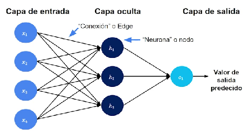
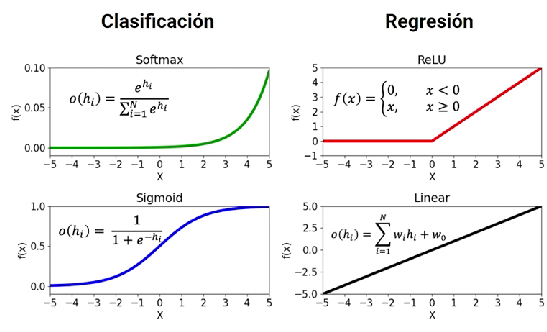
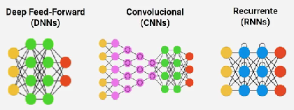

# Introducción a Machine Learning por MindsDB

- modelos de ML encuentran patrones de datos
- los modelos aprenden patrones de los features
url()

## Terminología
- <b>Data: </b> unidades de información o "hechos" observados.
- <b>Features: </b>tipos de información acerca de tus observaciones.
- <b>Outlier: </b>datos que se comportan de forma extraña.
- <b>Pre-processing:</b> preparar datos para su uso en modelos de ML.
- <b>ETL pipeline: </b>framework de data science para extraer, transformar y cargar.

## Conversión de etiquetas
Por ejemplo si se tienen datos tipe texto, se puede convertir a un código numérico de forma directa o a través de otras formas por ejemplo <b> 1-hot encodings (OHE) </b>: si se tiene (piedra, papel, tijera) se utiliza un sistema de positivos (1) o negativos (0). Para tijera <0,0,1>

## Tipos de modelos de ML
- <b>Aprendizaje supervisado:</b> el modelo obtiene un feature de entrada y de salida. Hay un target objetivo a predecir.
    - <b>Regresión:</b> Target output es numérico.
    - <b>Clasificación:</b> Target output es una etiqueta.
- <b>Aprendizaje no supervisado: </b> Objetivo desconocido, queremos encontrar estructura y grupos dentro de los datos.
    - <b>Clustering:</b> Queremos encontrar grupos de datos.
    - <b>Dimensionality reduction:</b> Queremos encontrar que features de entrada en los datos son de ayuda.

## Componentes de los algoritmos de ML
1)  Proceso de decisión
2)  Función de error/coste
3)  Regla de actualización

### Normalización de los fatos numéricos
$$
\~x_{i}=\frac{x_{i}-\mu}{\sigma}
$$

Entrenamiento - Validación - Testeo (del modelo)

## Algoritmos supervisados
### Regresión lineal

$$
y_{pred}=w_{1}x+w_{0}
$$
Función de coste (MSE):
$$
f(w,w_{0})=\frac{1}{N}\sum_{i=1}^{N}(y_{i}-y_{i,pred})^2
$$
Regla de actualización:
$$
Update Rule =minJ(w_{0}, w_{1})
$$
### Regresión logística (clasificación)
$$
p(suceso)=\frac{exp(w_{0}+w_{1}x_{1})}{1+exp(w_{0}+w_{1}x_{1})}
$$
Función de coste y regla de actualización
$$
J(w, w_{0})=-\frac{1}{N}\sum_{i=1}^{N}y_{i}log(p_{suceso})+(1-y_{i})log(1-p_{suceso})
$$
$$
Update Rule =minJ(w_{0}, w_{1})
$$
Problemas de rendimiento de la regresión logística (matriz de confusión):
|  |Positivo   |Negativo|
|--|-----------|--------|
|Predicción positiva|TP |FP|
|Predicción negativa|FN |TN|

$$
Acurrancy = \frac{correctly labeled}{of data points}
$$

## Algoritmos no supervisados
### Clustering
K-means: función de coste
$$
J(c^1,..,c^K)=\sum_{j=1}^{K}\sum_{x \epsilon S_{j}}||x_{i}^{j}-c^{j}||^2
$$
K-means: rendimiento
Inertia: que tan cerca están los puntos al centroide. Debe ser pequeño.

Silhouette score: qué tan lejanos son los clusters,[-1,1]. Debe ser cercano a 1.

 
 
 

# Deep learning

En general se utilizan para problemas de aprendizaje supervisado.

Cada conexión entre nodos es gobernada por la fuerza ($w_{i,j}$)

$i$ indica el parámetro (un término independiente y un parámetro por cada variable de entrada) y $j$ se refiere a la neurona $h_{j}$
$$
g_{1}(x)=w_{0,1}+w_{1,1}x_{1}+w_{2,1}x_{2}+w_{3,1}x_{3}+w_{4,1}x_{4}
$$
$g_{1}(x)$ se denomina combinación lineal de nodos de la capa.
Vamos a tener una expresión análoga para $g_{2}(x)$ y $g_{3}(x)$. Con la red entrenada vamos a poder calcular cada uno de esos valores los cuales van a ser reales en principio.

Hidden units
$$
h_{1}(x)=f_{1}(g_1(x))
$$
Donde $f_{1}(x)$ es la función de activación. Le asigna un "peso a una señal".

 

## Entrenamiento de redes neuronales
1) elegir arquitectura

2) "receta" de entrenamiento
3) ajustar tasa de entrenamiento

### Mejora de los modelos
Se debe llegar a modelos que expliquen los datos pero que no dejen de ser genéricos (evitar overfiting). Se debe llegar al máximo del rendimiento de validación

